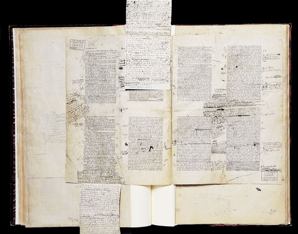

# Semantic Copying

_This repository collects ideas and experiments around extending standard *copy & paste* operation with provenance information too keep connection between source document and extracted copy._

## Cut & Paste

Before the age of personal computers _cut and paste_ referred to physcially cutting and rearrangement of document pieces on a desktop of floor. In the 1960s Ted Nelson realized that computers would allow for an extended form of document editing with cut pieces retaining their connection to source documents. However when digital document processing was established, cut-and-paste capabilities were partly _below_ their physical counterpart.

 
_See Nelson (2008), p. 129-131 for a short summary of the problem (the [image reference)[http://expositions.bnf.fr/brouillons/grand/45.htm] is taken from there)._

## Cut/Copy & Paste

The way cut/copy-and-paste works in todays computer systems was established by Larry Tesler in the 1970s at Xerox PARC. Backed up with usability studies he convinced his colleauges the three-way select-copy/cut-paste interaction (together with possible undo) superior to editing modes as implemented in Douglas Engelbert's NLS. Tesler later moved to Apple and helped to popularize the concept with Apple Lisa (1983) and Macintosh (1984), introducing the term "clipboard" and the common keyboard shortcuts Command + C (copy), Command + X (cut), and Command + V (paste). The operations have become ubiquitous at the latest with their adoption in Microsoft Windows (1985).

_TODO: X Window selection (1980s) and ICCCM (Rosenthal, 1988), also influenced by Xerox PARC GUI_

## Limitations and alternatives

_TODO: the following are notes_

Limitations of cut/copy-and-paste as currently implemented:

* The clipboard is invisible
* There is only one clipboard
* The connection between source document and copied segment is lost

Nelson envisions a workspace with snippets and versions of text can be shown side by side connected to each other. Tesler, in response to Nelson (cite by Nelson, 2008 p. 131):

> It is amazing to me that with today's wide screens, there are no word processors that support the features you mentioned.

Partial solutions or workaround:

* (spatial) hypertext systems
* clipboard managers

## Clipboard managers

Clipboard managers don't solve the problem at its root but they provide the best mechanism of integration in standard copy-and-paste mechanisms across applications.

...

## References

* Ted Nelson (2008): Geeks Bearing Gifts. Mindful Press. 
* Larry Tesler, L. (2012): A personal history of modeless text editing and cut/copy-paste. Interactions, 19(4), 70. https://doi.org/10.1145/2212877.2212896 

